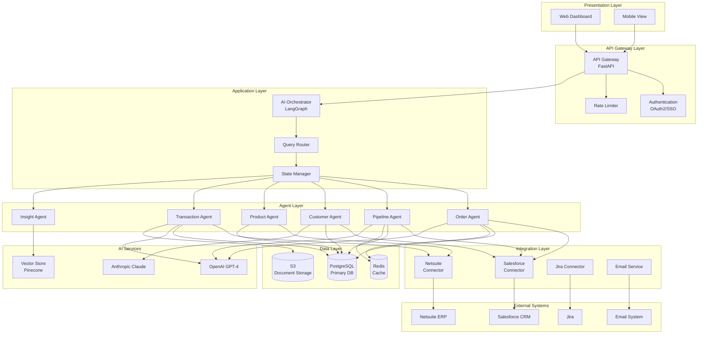
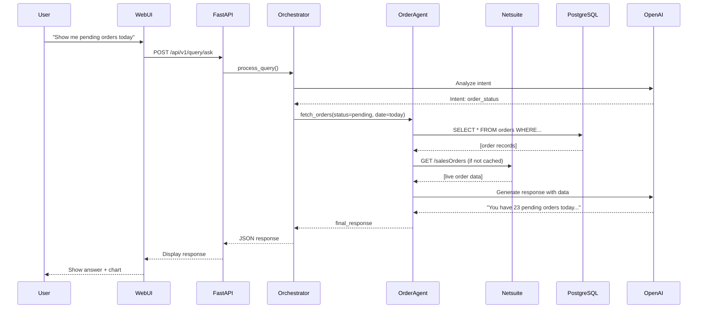
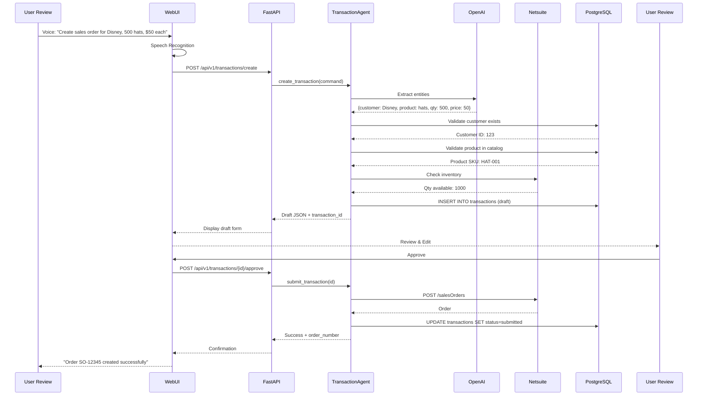
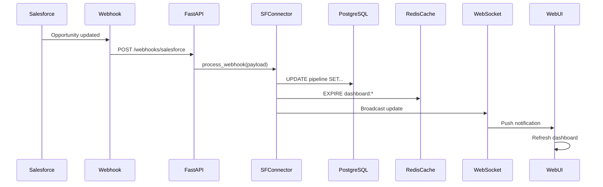
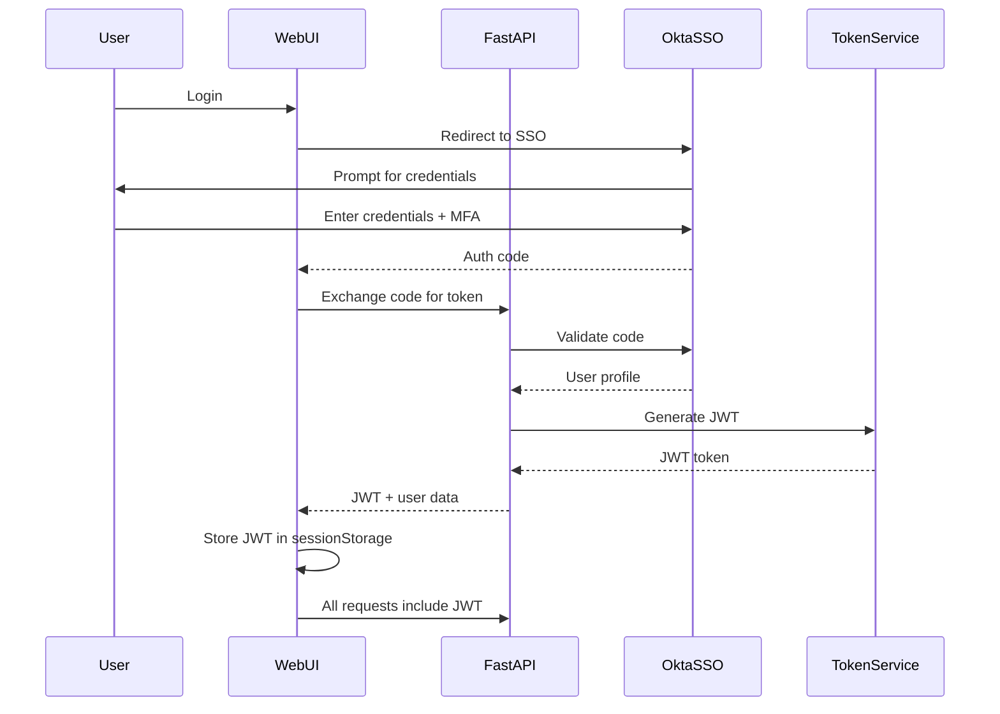
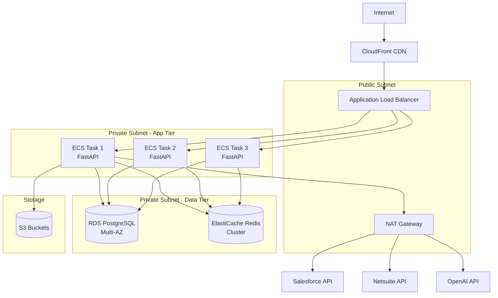
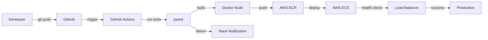

# Sales Command Center - System Architecture

## Document Information
- **Product**: Sales Command Center
- **Version**: 1.0
- **Date**: November 5, 2025
- **Architecture Type**: Microservices with AI Agent Orchestration

---

## Table of Contents
1. [Overview](#overview)
2. [High-Level Architecture](#high-level-architecture)
3. [Component Details](#component-details)
4. [Data Flow](#data-flow)
5. [Technology Stack](#technology-stack)
6. [Integration Architecture](#integration-architecture)
7. [Security Architecture](#security-architecture)
8. [Deployment Architecture](#deployment-architecture)
9. [Scalability & Performance](#scalability--performance)

---

## Overview

The Sales Command Center is an AI-powered, process-specific dashboard designed to provide sales executives with real-time visibility into sales operations and the ability to execute transactions through natural language commands.

### Design Principles

1. **Process-Specific Design**: Optimized for sales workflows, not a generic dashboard
2. **AI-First Architecture**: AI agents as first-class citizens in the system
3. **Real-Time Data**: Sub-30-second latency for all data queries
4. **Transactional Capability**: Beyond reporting - can execute business transactions
5. **Extensible Design**: Easy to add new agents, integrations, and features
6. **Cloud-Native**: Designed for horizontal scaling and high availability

### Key Architectural Decisions

| Decision | Rationale |
|----------|-----------|
| FastAPI for backend | High performance, async support, automatic API docs |
| LangGraph for orchestration | Best-in-class multi-agent orchestration with state management |
| PostgreSQL for database | Robust, ACID-compliant, excellent for transactional data |
| Redis for caching | In-memory speed for frequently accessed data |
| Webhook-based sync | Real-time updates without polling overhead |
| Monolithic frontend (v1) | Faster initial development, migrate to React in v2 |

---

## High-Level Architecture



---

## Component Details

### 1. Presentation Layer

#### Web Dashboard
**Technology**: HTML5, Tailwind CSS, JavaScript, Chart.js

**Responsibilities**:
- Render sales metrics and visualizations
- Provide AI chat interface
- Handle voice input via Web Speech API
- Display real-time notifications
- Responsive design for desktop and tablet

**Key Features**:
- Tab-based navigation (Overview, Pipeline, Orders, Customers, Products, AI Assistant)
- Real-time metric updates via WebSocket
- Interactive charts (line, bar, funnel, heat maps)
- Voice command button
- Quick action shortcuts

**Communication**:
- REST API calls to FastAPI backend
- WebSocket connection for real-time updates
- Local storage for user preferences

---

### 2. API Gateway Layer

#### FastAPI Server
**Technology**: FastAPI (Python 3.11+)

**Responsibilities**:
- Route HTTP requests to appropriate handlers
- Request validation (Pydantic models)
- Response serialization
- API documentation (Swagger/OpenAPI)
- Error handling and logging

**Endpoints**:
```
GET  /health                          # Health check
GET  /api/v1/dashboard/overview       # Dashboard overview metrics
GET  /api/v1/dashboard/pipeline       # Pipeline data
GET  /api/v1/orders                   # List orders
POST /api/v1/orders                   # Create order
GET  /api/v1/orders/{id}              # Get order details
GET  /api/v1/customers                # List customers
GET  /api/v1/products                 # List products
POST /api/v1/query/ask                # Natural language query
POST /api/v1/transactions/create      # Create transaction via AI
GET  /api/v1/insights                 # AI-generated insights
WS   /ws/dashboard                    # WebSocket for real-time updates
```

#### Authentication & Authorization
**Technology**: OAuth 2.0 / JWT

**Flow**:
1. User authenticates via SSO (Okta, Azure AD, etc.)
2. Backend validates token
3. JWT issued with user roles and permissions
4. All API requests include JWT in Authorization header
5. Middleware validates JWT and checks permissions

**Roles**:
- `sales_exec`: Full access
- `sales_manager`: Territory-level access
- `sales_rep`: Individual data only
- `finance_viewer`: Read-only access

---

### 3. Application Layer - AI Orchestration

#### AI Orchestrator (LangGraph)
**Technology**: LangGraph, LangChain

**Responsibilities**:
- Receive natural language queries from frontend
- Coordinate multiple AI agents
- Manage conversation state
- Handle multi-turn conversations
- Aggregate agent responses
- Return formatted results to frontend

**State Management**:
```python
class AgentState(TypedDict):
    query: str
    intent: str
    entities: Dict[str, Any]
    context: Dict[str, Any]
    agent_data: Dict[str, Any]
    final_response: str
    conversation_history: List[Dict]
```

#### Query Router
**Responsibilities**:
- Analyze user query using LLM
- Determine query intent (e.g., "order_status", "pipeline_query", "create_transaction")
- Extract entities (dates, products, customers, metrics)
- Route to appropriate agent(s)
- Handle multi-intent queries

**Example Routing**:
```
Query: "Show me pending orders for Disney this month"
→ Intent: order_status
→ Entities: {customer: "Disney", status: "pending", period: "this_month"}
→ Route to: OrderAgent

Query: "Create a sales order for 500 hats for Disney at $50 each"
→ Intent: create_transaction
→ Entities: {customer: "Disney", product: "hats", quantity: 500, price: 50}
→ Route to: TransactionAgent
```

---

### 4. Agent Layer

#### Order Agent
**Responsibilities**:
- Query order data from Salesforce/Netsuite
- Answer questions about order status, fulfillment, delivery
- Provide order analytics (fulfilled vs pending vs partially fulfilled)
- Track order aging

**Data Sources**:
- Netsuite (sales orders, fulfillment status)
- PostgreSQL (cached order data)
- Redis (frequently accessed orders)

**Example Queries**:
- "How many orders did I receive today?"
- "Show me pending orders over $100K"
- "What's the average order value this month?"

---

#### Pipeline Agent
**Responsibilities**:
- Query opportunity/deal data from Salesforce
- Analyze pipeline health (stage distribution, conversion rates)
- Identify at-risk deals
- Forecast revenue

**Data Sources**:
- Salesforce (opportunities, stages, probabilities)
- PostgreSQL (historical pipeline data)

**Example Queries**:
- "What's in my pipeline for Q1 2026?"
- "Show me deals stuck in negotiation"
- "What's my win rate this quarter?"

---

#### Customer Agent
**Responsibilities**:
- Query customer account data
- Analyze customer health and engagement
- Identify at-risk customers
- Recommend upsell/cross-sell opportunities

**Data Sources**:
- Salesforce (accounts, contacts, activities)
- PostgreSQL (customer interaction history)

**Example Queries**:
- "Who are my top 10 customers by revenue?"
- "Show me customers with declining purchases"
- "Which accounts need attention?"

---

#### Product Agent
**Responsibilities**:
- Query product catalog and sales data
- Analyze product performance
- Track inventory levels
- Provide product recommendations

**Data Sources**:
- Netsuite (product catalog, inventory, pricing)
- PostgreSQL (product sales history)

**Example Queries**:
- "Which products are selling best this quarter?"
- "Show me Cologuard sales trends"
- "What's the average selling price for Product A?"

---

#### Transaction Agent
**Responsibilities**:
- Create sales orders via voice/text commands
- Generate transaction drafts for user review
- Submit approved transactions to Netsuite
- Handle transaction errors and validations

**Workflow**:
1. Parse user command (e.g., "Create order for Disney, 500 hats, $50 each")
2. Extract transaction details
3. Validate customer, product, pricing
4. Check inventory availability
5. Generate draft sales order
6. Present draft to user for review/edit
7. On approval, submit to Netsuite API
8. Store transaction record in PostgreSQL
9. Return confirmation with order number

**Validations**:
- Customer exists in CRM
- Product in catalog
- Price within acceptable range
- Inventory available
- Credit limit check

---

#### Insight Agent
**Responsibilities**:
- Generate proactive insights and recommendations
- Detect anomalies (e.g., sudden drop in orders)
- Provide predictive analytics
- Daily/weekly executive summaries

**Techniques**:
- LLM-powered analysis of trends
- Statistical anomaly detection
- Rule-based alerts
- Vector similarity search for pattern matching

**Example Insights**:
- "Your win rate dropped 5% - here's why..."
- "Disney increased orders 25% - upsell opportunity"
- "3 large deals are stalled - recommend action"

---

### 5. Integration Layer

#### Salesforce Connector
**Technology**: Salesforce REST API, simple-salesforce Python library

**Responsibilities**:
- Authenticate with Salesforce (OAuth 2.0)
- Fetch accounts, opportunities, contacts, activities
- Update records (e.g., mark opportunity as won)
- Real-time sync via Salesforce Streaming API or webhooks

**Data Synced**:
- Accounts → `customers` table
- Opportunities → `pipeline` table
- Contacts → `contacts` table
- Activities → `interactions` table

**Sync Strategy**:
- Initial: Bulk API for historical data
- Ongoing: Webhook-based real-time updates
- Fallback: Scheduled sync every 5 minutes

**Rate Limiting**:
- Salesforce API: 15,000 requests/day
- Implement request queuing and caching

---

#### Netsuite Connector
**Technology**: Netsuite SuiteTalk REST API, Python requests

**Responsibilities**:
- Authenticate with Netsuite (Token-Based Authentication)
- Fetch sales orders, invoices, products, inventory
- Create new sales orders
- Update order status

**Data Synced**:
- Sales Orders → `orders` table
- Invoices → `invoices` table
- Products → `products` table
- Inventory → `inventory` table

**Sync Strategy**:
- Orders: Real-time write, near real-time read (webhook)
- Products/Inventory: Every 15 minutes
- Invoices: Every hour

---

#### Email Service Connector
**Technology**: SendGrid or AWS SES

**Responsibilities**:
- Send notification emails
- Deliver AI-generated email drafts
- Daily/weekly executive summaries

---

### 6. Data Layer

#### PostgreSQL Database
**Version**: PostgreSQL 15+

**Schema Overview**:

**Orders Table**:
```sql
CREATE TABLE orders (
    id SERIAL PRIMARY KEY,
    order_number VARCHAR(50) UNIQUE NOT NULL,
    customer_id INT REFERENCES customers(id),
    order_date TIMESTAMP NOT NULL,
    total_amount DECIMAL(12, 2),
    status VARCHAR(20), -- pending, fulfilled, partial, cancelled
    fulfillment_percentage INT,
    source_system VARCHAR(20), -- salesforce, netsuite
    external_id VARCHAR(100),
    created_at TIMESTAMP DEFAULT NOW(),
    updated_at TIMESTAMP DEFAULT NOW()
);
```

**Customers Table**:
```sql
CREATE TABLE customers (
    id SERIAL PRIMARY KEY,
    name VARCHAR(255) NOT NULL,
    industry VARCHAR(100),
    region VARCHAR(100),
    territory VARCHAR(100),
    account_manager_id INT,
    salesforce_id VARCHAR(50) UNIQUE,
    created_at TIMESTAMP DEFAULT NOW()
);
```

**Pipeline Table**:
```sql
CREATE TABLE pipeline (
    id SERIAL PRIMARY KEY,
    opportunity_name VARCHAR(255),
    customer_id INT REFERENCES customers(id),
    stage VARCHAR(50), -- lead, qualified, proposal, negotiation, closed_won, closed_lost
    amount DECIMAL(12, 2),
    probability INT,
    close_date DATE,
    owner_id INT,
    salesforce_id VARCHAR(50) UNIQUE,
    created_at TIMESTAMP DEFAULT NOW(),
    updated_at TIMESTAMP DEFAULT NOW()
);
```

**Products Table**:
```sql
CREATE TABLE products (
    id SERIAL PRIMARY KEY,
    sku VARCHAR(100) UNIQUE,
    name VARCHAR(255),
    description TEXT,
    unit_price DECIMAL(10, 2),
    inventory_qty INT,
    category VARCHAR(100),
    netsuite_id VARCHAR(50) UNIQUE
);
```

**Transactions Table** (AI-generated transactions):
```sql
CREATE TABLE transactions (
    id SERIAL PRIMARY KEY,
    transaction_type VARCHAR(20), -- sales_order, purchase_order
    draft JSON, -- AI-generated draft
    approved_by INT,
    status VARCHAR(20), -- draft, approved, submitted, failed
    external_order_id VARCHAR(100),
    created_at TIMESTAMP DEFAULT NOW(),
    submitted_at TIMESTAMP
);
```

**Conversation History Table**:
```sql
CREATE TABLE conversations (
    id SERIAL PRIMARY KEY,
    user_id INT,
    query TEXT,
    response TEXT,
    intent VARCHAR(50),
    agents_used VARCHAR(255), -- comma-separated list
    created_at TIMESTAMP DEFAULT NOW()
);
```

#### Redis Cache
**Usage**:
- Cache frequently accessed orders (last 30 days)
- Cache dashboard metrics (TTL: 30 seconds)
- Session storage
- Rate limiting counters

**Key Patterns**:
```
order:{order_id} → Order details
dashboard:overview:{user_id} → Dashboard metrics
pipeline:summary:{user_id} → Pipeline summary
ratelimit:{user_id}:{endpoint} → Request count
```

#### S3 Document Storage
**Usage**:
- Store transaction draft PDFs
- Email templates
- Reports generated for download
- Audit logs (long-term retention)

---

## Data Flow Diagrams

### Flow 1: Natural Language Query


---

### Flow 2: Voice-Activated Transaction Creation


---

### Flow 3: Real-Time Data Sync (Webhook)


---

## Technology Stack

### Backend
| Component | Technology | Version | Purpose |
|-----------|-----------|---------|---------|
| Web Framework | FastAPI | 0.104+ | API server |
| Language | Python | 3.11+ | Primary language |
| AI Orchestration | LangGraph | 0.1+ | Multi-agent coordination |
| LLM Integration | LangChain | 0.1+ | LLM abstractions |
| LLM Provider | OpenAI GPT-4 | gpt-4-turbo | Natural language understanding |
| Database | PostgreSQL | 15+ | Primary data store |
| Cache | Redis | 7+ | In-memory cache |
| Task Queue | Celery + RabbitMQ | - | Async job processing |
| ORM | SQLAlchemy | 2.0+ | Database abstraction |
| Validation | Pydantic | 2.0+ | Data validation |
| Testing | Pytest | 7+ | Unit & integration tests |

### Frontend
| Component | Technology | Version | Purpose |
|-----------|-----------|---------|---------|
| HTML/CSS | HTML5, Tailwind CSS | 3.3+ | UI structure & styling |
| JavaScript | Vanilla JS | ES6+ | Interactivity |
| Charts | Chart.js | 4.0+ | Data visualization |
| Speech | Web Speech API | - | Voice input |
| HTTP Client | Fetch API | - | API calls |

### Infrastructure
| Component | Technology | Purpose |
|-----------|-----------|---------|
| Cloud Provider | AWS | Hosting |
| Compute | AWS ECS/Fargate | Container orchestration |
| Load Balancer | AWS ALB | Traffic distribution |
| Database | AWS RDS (PostgreSQL) | Managed database |
| Cache | AWS ElastiCache (Redis) | Managed cache |
| Storage | AWS S3 | Document storage |
| CDN | AWS CloudFront | Static asset delivery |
| Monitoring | AWS CloudWatch + Datadog | Logging & metrics |
| CI/CD | GitHub Actions | Automation |

---

## Security Architecture

### Authentication Flow


### Data Security
- **Encryption in Transit**: TLS 1.3 for all communications
- **Encryption at Rest**: AES-256 for database and S3
- **API Keys**: Stored in AWS Secrets Manager
- **Database Credentials**: Rotated every 90 days
- **Audit Logging**: All transactions logged to S3 for 7 years

### Network Security
- **VPC**: All backend services in private subnets
- **Security Groups**: Whitelist-based access
- **WAF**: AWS WAF for DDoS protection
- **Rate Limiting**: 100 requests/minute per user

---

## Deployment Architecture

### Production Environment (AWS)


### Deployment Pipeline (CI/CD)


---

## Scalability & Performance

### Horizontal Scaling Strategy
- **API Servers**: Auto-scaling group (min: 2, max: 10 instances)
- **Database**: Read replicas for reporting queries
- **Cache**: Redis cluster mode for high availability
- **Queue**: Multiple Celery workers for async tasks

### Performance Optimizations
1. **Caching**:
   - Dashboard metrics cached for 30 seconds
   - Order details cached for 5 minutes
   - Product catalog cached for 1 hour

2. **Database Optimization**:
   - Indexes on frequently queried fields (customer_id, order_date, status)
   - Partitioning for large tables (orders by month)
   - Connection pooling (max 20 connections per instance)

3. **API Optimization**:
   - Response compression (gzip)
   - Pagination for list endpoints (max 100 items)
   - ETags for conditional requests

4. **CDN**:
   - Static assets (JS, CSS, images) served via CloudFront
   - Edge caching for faster global access

### Monitoring & Alerting
**Metrics**:
- API response time (p50, p95, p99)
- Error rate (4xx, 5xx)
- Database query time
- Cache hit rate
- Active WebSocket connections

**Alerts**:
- API response time > 5 seconds
- Error rate > 1%
- Database CPU > 80%
- Cache hit rate < 70%
- Disk usage > 85%

---

## Future Enhancements

### Phase 2 Features
1. **Advanced Analytics**:
   - Machine learning for lead scoring
   - Churn prediction
   - Revenue forecasting with ML models

2. **Mobile Native Apps**:
   - iOS and Android apps
   - Offline mode with sync

3. **Enhanced AI**:
   - Multi-modal AI (analyze images, PDFs)
   - Autonomous agents (schedule meetings, send follow-ups)
   - Personalized insights based on user behavior

4. **Additional Integrations**:
   - Marketing automation (HubSpot, Marketo)
   - Communication tools (Slack, Teams)
   - BI tools (Tableau, PowerBI)

---

## Glossary

- **Agent**: Specialized AI component responsible for a specific domain (e.g., orders, pipeline)
- **Orchestrator**: Coordination layer managing multiple agents
- **LangGraph**: Framework for building multi-agent systems with state management
- **ECS**: Elastic Container Service (AWS)
- **Webhook**: HTTP callback triggered by external system events

---

## References

- [FastAPI Documentation](https://fastapi.tiangolo.com/)
- [LangGraph Documentation](https://python.langchain.com/docs/langgraph)
- [Salesforce API Reference](https://developer.salesforce.com/)
- [Netsuite SuiteTalk API](https://docs.oracle.com/en/cloud/saas/netsuite/)
- [AWS Well-Architected Framework](https://aws.amazon.com/architecture/well-architected/)

---

**Document Version**: 1.0
**Last Updated**: November 5, 2025
**Maintained By**: Architecture Team
